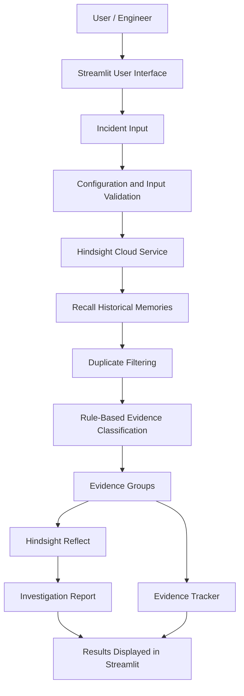
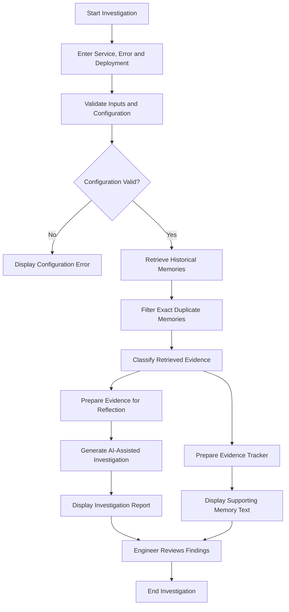
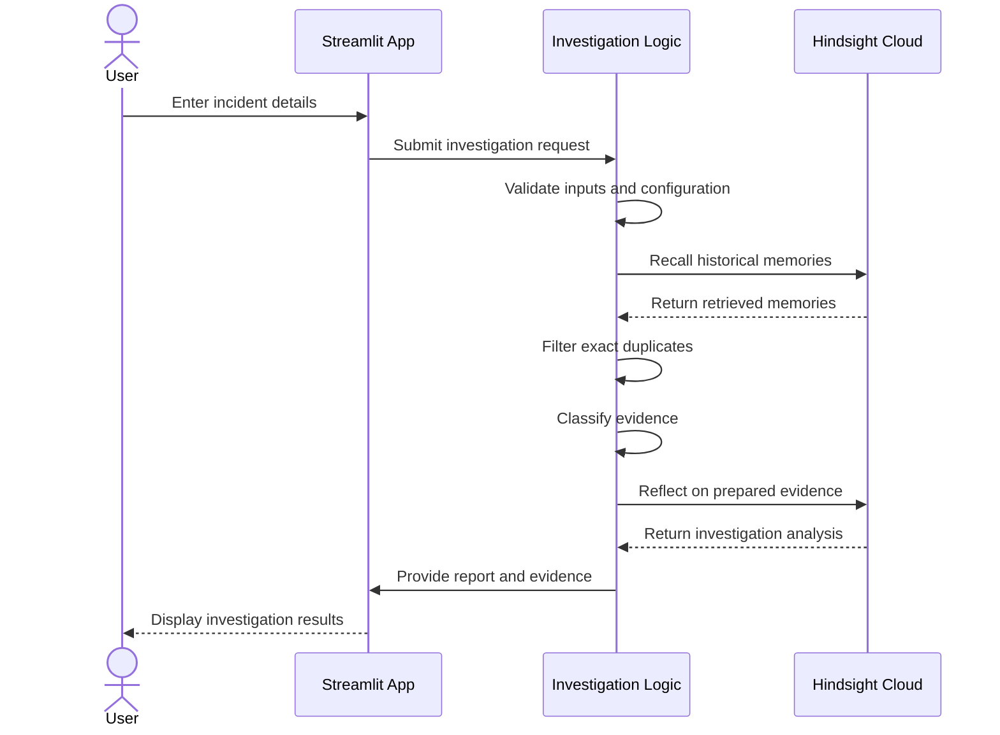

# OpsMemory — System Architecture

## 1. High-Level System Architecture

```mermaid
flowchart TD
    A["User / Engineer"] --> B["Streamlit User Interface"]
    B --> C["Incident Input"]
    C --> D["Configuration and Input Validation"]
    D --> E["Hindsight Cloud Service"]
    E --> F["Recall Historical Memories"]
    F --> G["Duplicate Filtering"]
    G --> H["Rule-Based Evidence Classification"]
    H --> I["Evidence Groups"]
    I --> J["Hindsight Reflect"]
    J --> K["Investigation Report"]
    I --> L["Evidence Tracker"]
    K --> M["Results Displayed in Streamlit"]
    L --> M
```

## 2. Incident Investigation Workflow

```mermaid
flowchart TD
    A["Start Investigation"] --> B["Enter Service, Error and Deployment"]
    B --> C["Validate Inputs and Configuration"]
    C --> D{"Configuration Valid?"}
    D -- No --> E["Display Configuration Error"]
    D -- Yes --> F["Retrieve Historical Memories"]
    F --> G["Filter Exact Duplicate Memories"]
    G --> H["Classify Retrieved Evidence"]
    H --> I["Prepare Evidence for Reflection"]
    I --> J["Generate AI-Assisted Investigation"]
    J --> K["Display Investigation Report"]
    H --> L["Prepare Evidence Tracker"]
    L --> M["Display Supporting Memory Text"]
    K --> N["Engineer Reviews Findings"]
    M --> N
    N --> O["End Investigation"]
```

## 3. Evidence Retrieval Sequence

```mermaid
sequenceDiagram
    actor User
    participant UI as Streamlit App
    participant App as Investigation Logic
    participant H as Hindsight Cloud

    User->>UI: Enter incident details
    UI->>App: Submit investigation request
    App->>App: Validate inputs and configuration
    App->>H: Recall historical memories
    H-->>App: Return retrieved memories
    App->>App: Filter exact duplicates
    App->>App: Classify evidence
    App->>H: Reflect on prepared evidence
    H-->>App: Return investigation analysis
    App->>UI: Provide report and evidence
    UI-->>User: Display investigation results
```
